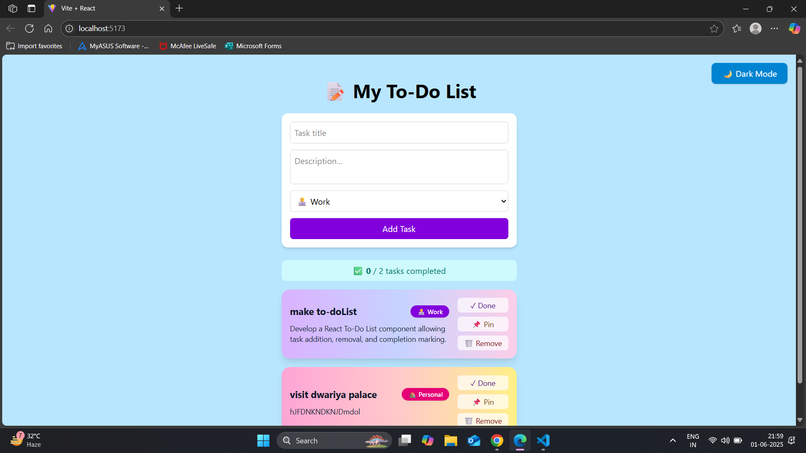
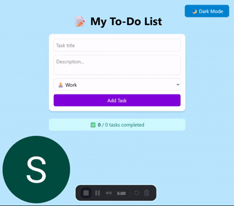

# 📝 My To-Do List 

A modern and colorful React To-Do List application with task pinning, productivity tracking, and an elegant UI — built using **React** and **Tailwind CSS**.

---

## 📸 Screenshot



---

## ✨ Features

- ✅ Add tasks with title, description, and category
- 📌 Pin important tasks
- 🧠 Completion tracking with a productivity score
- 🎨 Beautiful task cards with pastel colors
- 💾 Data stored in LocalStorage
- ⚡ Responsive layout with Tailwind CSS
- 🌗 Toggle between Light and Dark Mode with a single click
- ℹ️ Info button to explain task categories (Work, Personal, Study, Others)
  
---
## 🎥 Live Demo

Watch the live demo:  
[

---
## 🚀 Getting Started

### 1. Clone the Repository

```bash
git clone https://github.com/yourusername/my-todo-list
cd my-todo-list
